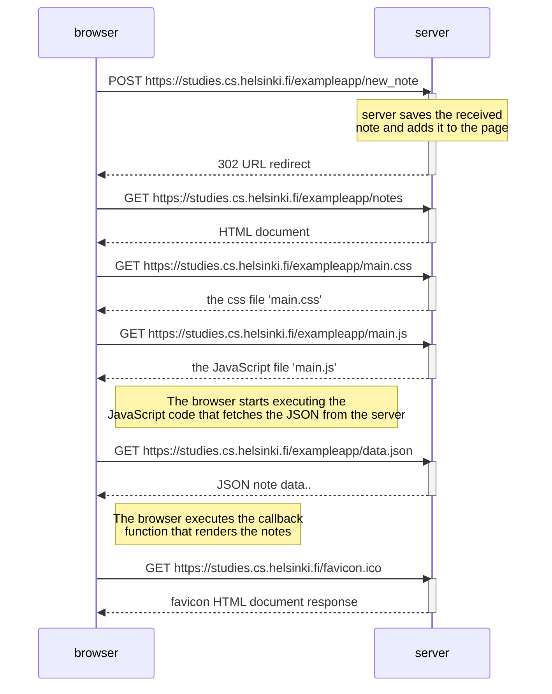

```mermaid
sequenceDiagram
    participant browser
    participant server
	
	browser->>server: POST https://studies.cs.helsinki.fi/exampleapp/new_note
	activate server
	
	Note over server: server saves the received <br/> note and adds it to the page	
	
	server-->>browser: 302 URL redirect
	deactivate server

    
    browser->>server: GET https://studies.cs.helsinki.fi/exampleapp/notes
    activate server
    server-->>browser: HTML document
    deactivate server

    browser->>server: GET https://studies.cs.helsinki.fi/exampleapp/main.css
    activate server
    server-->>browser: the css file 'main.css'
    deactivate server

    browser->>server: GET https://studies.cs.helsinki.fi/exampleapp/main.js
    activate server
    server-->>browser: the JavaScript file 'main.js'
    deactivate server

    Note right of browser: The browser starts executing the <br/> JavaScript code that fetches the JSON from the server

    browser->>server: GET https://studies.cs.helsinki.fi/exampleapp/data.json
    activate server
    server-->>browser: JSON note data..
    deactivate server

    Note right of browser: The browser executes the callback <br/> function that renders the notes
    
	browser->>server: GET https://studies.cs.helsinki.fi/favicon.ico
    activate server
    server-->>browser: favicon HTML document response
    deactivate server
```
