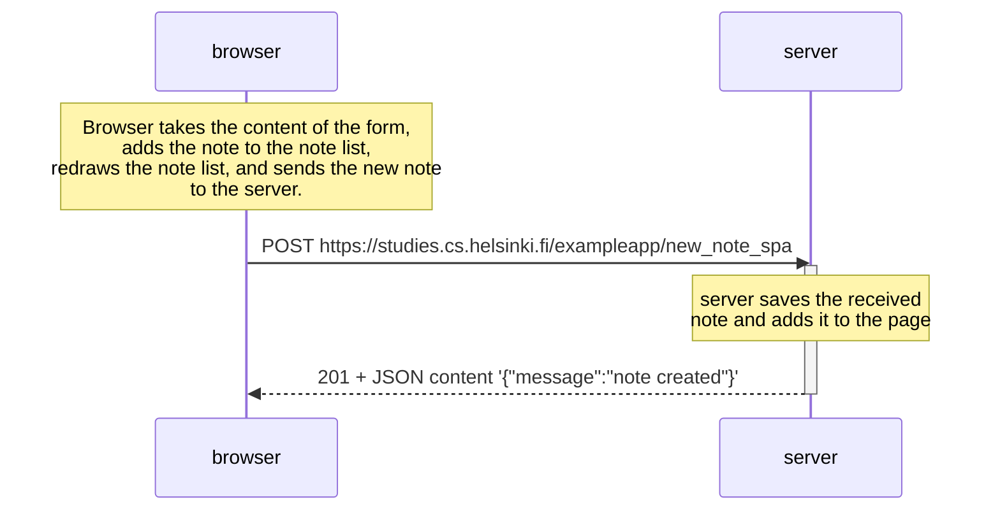

```mermaid
sequenceDiagram
    participant browser
    participant server
    
	Note over browser: Browser takes the content of the form, <br/> adds the note to the note list, <br/> redraws the note list, and sends the new note <br/> to the server.

    browser->>server: POST https://studies.cs.helsinki.fi/exampleapp/new_note_spa
    activate server
	Note over server: server saves the received <br/> note and adds it to the page
    server-->>browser: 201 + JSON content '{"message":"note created"}'
    deactivate server
```
